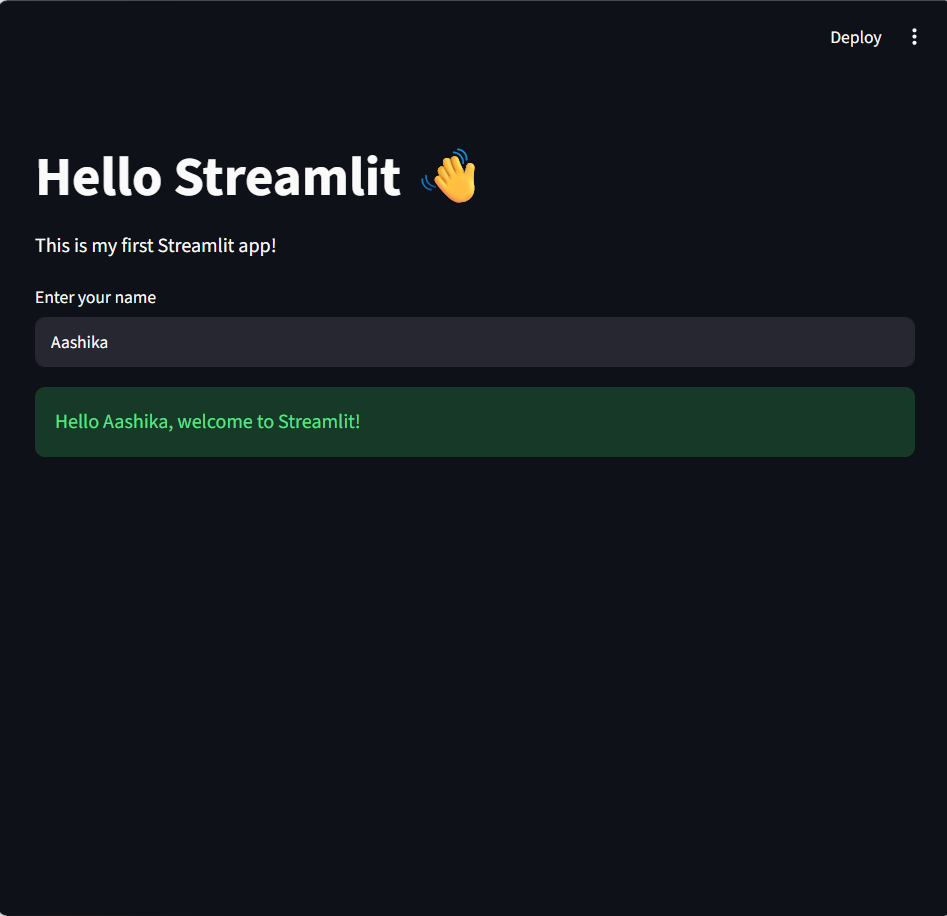
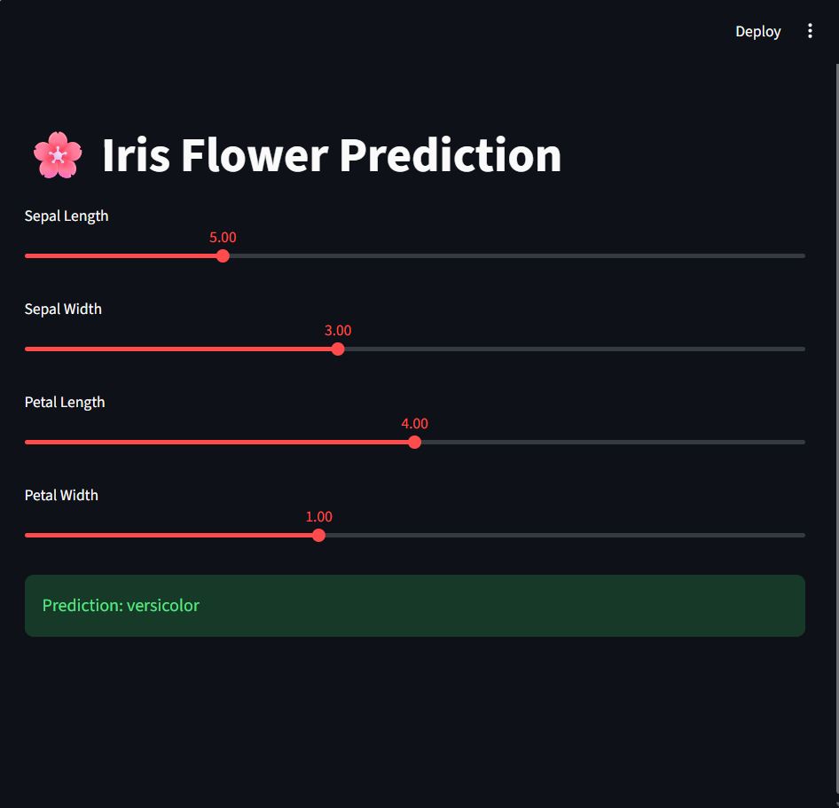

# 🚀 Day 13 - Streamlit Applications

This repository contains Streamlit applications developed during my internship.  
The project demonstrates basic Streamlit UI components, widget usage, and a Machine Learning-based Iris classification app.

---

## 📁 Project Structure

Day13/
│── app.py # Basic Streamlit application
│── app_fun.py # Streamlit widgets demonstration
│── iris_app.py # Iris Flower Classification (ML model)
│── requirements.txt
│── README.md

---

## 📌 Applications Overview

### 1. 🟢 Basic Streamlit App (`app.py`)
A simple introduction to Streamlit showing text, inputs, and layout features.

---

### 2. 🎛️ Streamlit Widgets Demo (`app_fun.py`)
Demonstrates commonly used Streamlit widgets such as:
- Buttons
- Sliders
- Text inputs
- Select boxes
- Checkboxes

---

### 3. 🌸 Iris Flower Classification (`iris_app.py`)
A Machine Learning web app that predicts Iris flower species based on input features:
- Sepal length
- Sepal width
- Petal length
- Petal width

Model trained using the classic Iris dataset.

---

## ⚙️ Installation

Install dependencies using:

pip install -r requirements.txt

▶️ How to Run

Run each Streamlit app using the following commands:

streamlit run app.py

or

streamlit run app_fun.py

or

streamlit run iris_app.py

📸 Output Preview

🎯 Objective

The goal of this project is to:

    Learn Streamlit framework
    Build interactive Python web apps
    Apply Machine Learning in real-world UI

## 🔗 Live Application

You can view the live deployed application here: 

👉 [Simple App(app.py)](https://srishti-innovative-internship-5pvck8atftdx57p6sgf9cr.streamlit.app/)

👉 [Widgets Demo(app_fun.py)](https://srishti-innovative-internship-3savpseltyxwtn9mxakbmt.streamlit.app/)

👉 [Iris App(iris_app.py)](https://srishti-innovative-internship-b4nabre2ua8vvmp7ndi8qe.streamlit.app/)
