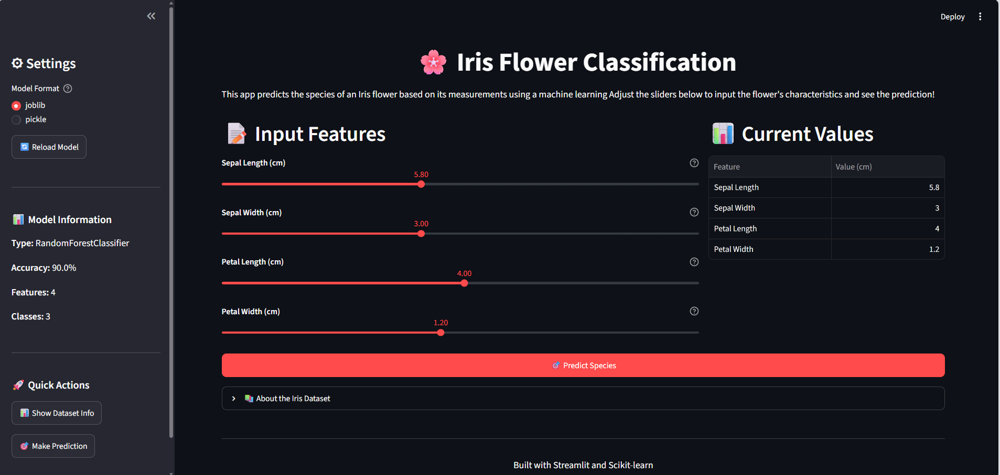

# 🚀 Day 14 - Model Deployment using Streamlit

This project demonstrates how to build and deploy a Machine Learning model using **Streamlit**.  
It includes data preprocessing, model training, and an interactive web application for predictions.

---
## 📁 Project Structure

Day14/
│── model/ # Trained ML model files
│── app.py # Streamlit application
│── app.ipynb # Model training & experimentation
│── requirements.txt # Project dependencies
│── README.md

---
## 📌 Project Overview

The goal of this project is to:
- Train a Machine Learning model
- Save and load the trained model
- Build an interactive web UI using Streamlit
- Make real-time predictions using user inputs

---
## ⚙️ Installation

Install dependencies using:

pip install -r requirements.txt

▶️ How to Run

Run each Streamlit app using the following commands:

streamlit run app.py

---
🎯 Features
Interactive UI using Streamlit
Real-time ML predictions
Clean and simple user interface
Model loaded from saved files
Easy-to-use sliders / inputs

---
📊 Output

The application allows users to:

Enter input values
Get instant predictions from the trained model
View results in a web interface

---
📸 Output Preview

---
Streamlit App

